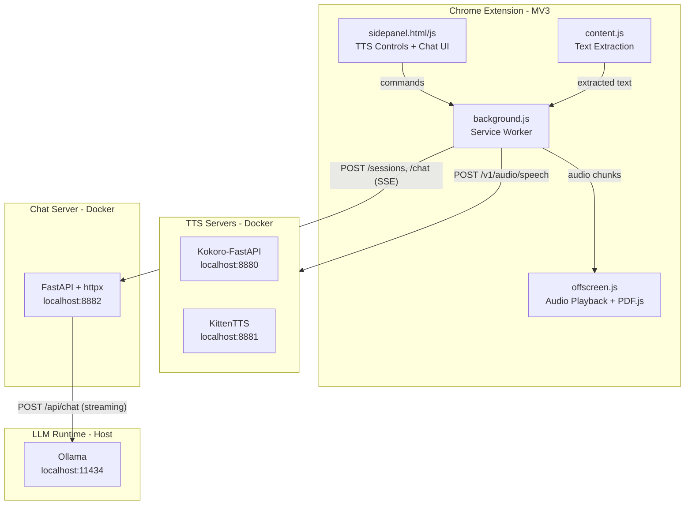

<p align="center">
  
</p>

<h1 align="center">Voxlocal</h1>

<p align="center">
  Read web pages aloud and chat about them with a local LLM.<br>
  No cloud APIs. No data leaves your machine.
</p>

<p align="center">
  <b>Read Aloud</b> &middot; <b>Chat with Pages</b> &middot; <b>Thinking Tokens</b> &middot; <b>PDF Support</b> &middot; <b>100% Local</b>
</p>

<p align="center">
  
  
  
  
  <a href="LICENSE"></a>
</p>

---

<!-- TODO: Add screenshot or demo GIF here -->

## Why

Browser read-aloud tools either send your content to external servers or sound robotic. AI assistants require cloud subscriptions. Voxlocal gives you both -- natural-sounding speech from modern open-source TTS models and a conversational AI for any page -- running entirely on your own hardware.

## What it does

- **Read aloud** -- articles, PDFs (including arxiv), tweets, and selected text
- **Chat with pages** -- ask questions, request summaries, discuss content with a local LLM
- **Thinking tokens** -- see the model's reasoning in real-time via a collapsible thinking block
- **Model selector** -- pick any locally pulled Ollama model from the chat panel
- **Side panel UI** -- TTS controls and chat live together in Chrome's side panel
- **Two TTS backends** -- Kokoro-FastAPI (50+ voices, multi-language) or KittenTTS (lightweight, English)
- **Markdown rendering** -- AI responses render with full markdown: headers, lists, code blocks, tables
- **Gapless playback** -- sentence-level chunks with pre-fetching for smooth audio
- **Read AI responses** -- click the speaker icon on any AI response to hear it read aloud
- **Fully offline** -- everything runs locally via Docker and Ollama

## How it's built

### Architecture



### Extension (Chrome MV3, vanilla JS)

Plain JavaScript, no build step. Everything consolidates into a single **Chrome Side Panel** -- clicking the extension icon opens the panel with TTS controls on top (~25%) and a chat interface below (~75%).

Key MV3 constraints that shaped the design:

- **Service workers can't play audio.** All playback happens in an [offscreen document](https://developer.chrome.com/docs/extensions/reference/api/offscreen). Messages route between background and offscreen using a `target` field.
- **No popups.** The side panel replaces the popup entirely (`openPanelOnActionClick: true`). It persists across tab navigation and has full Chrome API access.
- **Content scripts extract text.** Mozilla Readability runs on a cloned DOM. PDF detection hands off to the background, which fetches the PDF and sends it to the offscreen document where PDF.js runs.

### Text-to-speech pipeline

1. **Extraction** -- content script pulls text based on page type
2. **Cleaning** -- strips markdown, HTML, processes URLs into readable form
3. **Sentence splitting** -- splits on `.!?` while protecting abbreviations and decimals
4. **Chunking** -- groups sentences into ~500 character chunks
5. **TTS** -- each chunk sent as `POST /v1/audio/speech` to the local TTS server
6. **Pre-fetching** -- chunk N+1 fetched while chunk N plays
7. **Playback** -- audio plays in offscreen document via `<audio>` + Web Audio API

### Chat pipeline

1. **Session creation** -- side panel extracts page text and sends to chat server
2. **Workspace** -- server creates a folder in `~/.voxlocal/workspaces/{session_id}/` with `context.txt` (page content), `history.json` (conversation), and `meta.json` (URL, title)
3. **Streaming** -- chat server calls Ollama's native `/api/chat` endpoint via `httpx.AsyncClient.stream()`, forwarding response tokens as SSE events in real-time
4. **Thinking tokens** -- Ollama's native API puts reasoning in `message.thinking`. The server emits `think_start`/`think`/`think_end` SSE events, rendered in a collapsible `<details>` block with a spinner and duration
5. **Markdown** -- AI responses are rendered with marked.js (headers, lists, code blocks, tables)
6. **Read aloud** -- each AI response has a speaker button that sends the text through the TTS pipeline

### TTS backends

Both expose an [OpenAI-compatible](https://platform.openai.com/docs/api-reference/audio/createSpeech) API.

**Kokoro-FastAPI** (default, port 8880) wraps [Kokoro-82M](https://huggingface.co/hexgrad/Kokoro-82M) in a FastAPI server with CPU inference via ONNX Runtime. 50+ voices, multi-language. Docker image: `ghcr.io/remsky/kokoro-fastapi-cpu:v0.2.4`.

**KittenTTS** (port 8881) is a lightweight Python TTS library. We wrote a FastAPI wrapper (`servers/kittentts/`) exposing the same endpoints. 8 English voices, very lightweight.

### Chat backend

FastAPI server using direct **httpx** calls to **Ollama**'s native `/api/chat` endpoint. The chat server (`servers/chat/`) handles:
- Per-session workspace directories with page content saved as files
- Multi-turn conversation history
- Real-time SSE streaming with separate thinking/content token events
- Model selection (any locally pulled Ollama model)
- Runs in Docker with the workspace volume mounted from the host

## Third-party projects

| Project | What it does | Where it's used | License |
|---------|-------------|-----------------|---------|
| [Kokoro-FastAPI](https://github.com/remsky/Kokoro-FastAPI) | OpenAI-compatible TTS server for Kokoro-82M | Docker container, port 8880 | Apache 2.0 |
| [Kokoro-82M](https://huggingface.co/hexgrad/Kokoro-82M) | 82M parameter text-to-speech model | Used by Kokoro-FastAPI | Apache 2.0 |
| [KittenTTS](https://github.com/KittenML/KittenTTS) | Lightweight TTS library (ONNX, CPU) | Wrapped in `servers/kittentts/` | MIT |
| [Ollama](https://ollama.com/) | Local LLM runtime | Runs any model for chat | MIT |
| [Mozilla Readability](https://github.com/mozilla/readability) | Article content extraction | Bundled as `extension/lib/readability.js` | Apache 2.0 |
| [PDF.js](https://mozilla.github.io/pdf.js/) | PDF text extraction | Bundled as `extension/lib/pdf.min.mjs` (v4.10.38) | Apache 2.0 |
| [marked](https://github.com/markedjs/marked) | Markdown parser | Bundled as `extension/lib/marked.min.js` (v15.0.7) | MIT |
| [FastAPI](https://fastapi.tiangolo.com/) | Python web framework | Chat + KittenTTS server wrappers | MIT |

### Forked from

Based on [local_tts_reader](https://github.com/phildougherty/local_tts_reader) by Phil Dougherty. Voxlocal is a substantial rewrite adding the chat interface, thinking token streaming, model selection, markdown rendering, side panel UI, PDF support, Twitter extraction, KittenTTS backend, and gapless playback.

## Quick start

### 1. Install Ollama

```bash
# macOS
brew install ollama

# Or download from https://ollama.com/download

# Start Ollama and pull a model
ollama serve &
ollama pull qwen3.5:35b
```

### 2. Start the servers

```bash
git clone https://github.com/kargarisaac/voxlocal.git
cd voxlocal

# Create the workspaces directory
mkdir -p ~/.voxlocal/workspaces

# Start TTS + chat server
docker compose up -d kokoro-tts chat-server

# Or start everything (including KittenTTS)
docker compose up -d
```

Wait ~30 seconds for models to load, then verify:

```bash
# TTS
curl http://localhost:8880/health

# Chat server
curl http://localhost:8882/health
```

### 3. Load the extension

1. Open `chrome://extensions/`
2. Enable **Developer mode** (top-right toggle)
3. Click **Load unpacked** and select the `extension/` directory
4. Click the Voxlocal icon in the toolbar -- the side panel opens

### 4. Use it

**Read a page:** Click the play button in the side panel. The extension auto-extracts article content.

**Chat about a page:** Type a message in the chat input. The page content is automatically loaded as context.

**Switch models:** Use the model dropdown in the chat panel to pick any locally pulled Ollama model.

**Read AI responses aloud:** Click the speaker icon on any AI response.

**Read selected text:** Select text, right-click, choose "Read aloud with Voxlocal".

**Read a PDF:** Open a PDF in Chrome. The PDF section appears in the side panel with page range controls.

**Keyboard shortcuts:** `Alt+Shift+R` to read/pause, `Alt+Shift+S` to stop.

### Switching the TTS backend

Voxlocal ships with two TTS backends. **Kokoro-FastAPI** is the default (50+ voices, multi-language). **KittenTTS** is a lighter alternative (8 English voices).

1. Make sure both services are running:
   ```bash
   docker compose up -d kokoro-tts kittentts
   ```
2. Open **Settings** -- click the "Settings" link in the side panel footer, or go to `chrome://extensions` > Voxlocal > Options.
3. Change the **Backend** dropdown from "Kokoro TTS" to "KittenTTS". The server URL and voice list update automatically.
4. Pick a voice from the new voice list and click **Save**.

The extension auto-detects which backends are online and shows their status in the side panel. You can switch back anytime by changing the dropdown in Settings.

To list all available voices for either backend:

```bash
curl http://localhost:8880/v1/audio/voices   # Kokoro
curl http://localhost:8881/v1/audio/voices   # KittenTTS
```

## Configuration

Open **Settings** (link in side panel footer, or `chrome://extensions` > Voxlocal > Options).

| Setting | Default | Description |
|---------|---------|-------------|
| Backend | Kokoro TTS | Which TTS server to use |
| Server URL | `http://localhost:8880/v1/audio/speech` | TTS endpoint |
| Voice | `af_heart` | TTS voice |
| Speed | 1.0x | Playback speed (0.5x - 3.0x) |
| Auto Reader Mode | On | Use Readability for article extraction |
| Pre-process Text | On | Clean markdown, URLs, symbols before TTS |
| Max Chunk Size | 500 | Characters per TTS request |

### Chat server environment variables

| Variable | Default | Description |
|----------|---------|-------------|
| `OLLAMA_BASE_URL` | `http://host.docker.internal:11434` | Ollama API endpoint |
| `MODEL_NAME` | `qwen3.5:35b` | Default Ollama model |
| `WORKSPACES_DIR` | `/workspaces` | Session workspace directory (in container) |
| `MAX_HISTORY_TURNS` | `50` | Max conversation turns to include as context |

## Docker services

| Service | Port | Image / Build | Description |
|---------|------|---------------|-------------|
| `kokoro-tts` | 8880 | `ghcr.io/remsky/kokoro-fastapi-cpu:v0.2.4` | Kokoro TTS |
| `kittentts` | 8881 | Built from `servers/kittentts/` | KittenTTS wrapper |
| `chat-server` | 8882 | Built from `servers/chat/` | Chat server (Ollama streaming) |

Ollama runs on the host (not Docker) and is accessed by the chat server via `host.docker.internal:11434`.

## Project structure

```
voxlocal/
  extension/                      Chrome extension (load unpacked from here)
    manifest.json                 Chrome MV3 manifest
    background.js                 Service worker: TTS, chunking, state, routing
    content.js                    Content script: text extraction only
    sidepanel.html / sidepanel.js Side panel: TTS controls + chat UI
    offscreen.html / offscreen.js Audio playback + PDF text extraction
    options.html / options.js     Settings page
    constants.js                  Backend definitions, default settings
    lib/
      readability.js              Mozilla Readability (~91KB)
      pdf.min.mjs                 PDF.js main module (~353KB)
      pdf.worker.min.mjs          PDF.js web worker (~1.4MB)
      marked.min.js               Markdown parser (~39KB)
    utils/
      textProcessor.js            Text cleaning, sentence splitting, chunking
      audioPlayer.js              Side panel audio control abstraction
      pdfExtractor.js             PDF.js wrapper for text extraction
    icons/
      icon16.png / icon48.png / icon128.png
  servers/
    chat/
      server.py                   FastAPI + direct Ollama streaming via httpx
      Dockerfile                  Python 3.12-slim
      requirements.txt            fastapi, uvicorn, pydantic, httpx
    kittentts/
      server.py                   FastAPI wrapper for KittenTTS
      Dockerfile                  Python 3.12-slim + espeak-ng + ffmpeg
      requirements.txt
  docker-compose.yml              All services
  .editorconfig                   Editor formatting rules
  CONTRIBUTING.md                 Contributor guide
  LICENSE                         MIT
```

## Workspace structure

Each chat session creates a workspace in `~/.voxlocal/workspaces/`:

```
~/.voxlocal/workspaces/
  a1b2c3d4e5f6/
    context.txt       Page text content
    history.json      Conversation turns [{role, content}, ...]
    meta.json         Page URL and title
```

## Troubleshooting

**"TTS offline" in side panel**
- Check containers: `docker compose ps`
- Check logs: `docker compose logs kokoro-tts`
- Verify: `curl http://localhost:8880/health`

**"LLM offline" in side panel**
- Check Ollama is running: `ollama ls`
- Check chat server: `docker compose logs chat-server`
- Verify: `curl http://localhost:8882/health`
- Make sure the model is pulled: `ollama pull qwen3.5:35b`

**Chat responses are slow**
- Larger models are slower. Try `qwen3.5:4b` for faster responses.
- Change the default model: edit `MODEL_NAME` in `docker-compose.yml` and restart. Or just switch models in the chat panel dropdown.

**No text extracted**
- Wait for SPAs to load, then re-open the side panel.
- Try selecting text and right-click > "Read aloud with Voxlocal".

**PDF not working**
- Remote PDFs (http/https) work out of the box.
- For local `file://` PDFs: enable "Allow access to file URLs" in `chrome://extensions/`.

## Requirements

- Chrome 116+ (side panel + `sidePanel.open()` support)
- Docker and Docker Compose
- Ollama installed on host with a model pulled
- ~2GB disk for Kokoro Docker image
- ~23GB for qwen3.5:35b model (or less for smaller models)

## License

MIT License. See [LICENSE](LICENSE).

## Acknowledgments

- [Kokoro-FastAPI](https://github.com/remsky/Kokoro-FastAPI) by remsky
- [Kokoro-82M](https://huggingface.co/hexgrad/Kokoro-82M) by hexgrad
- [KittenTTS](https://github.com/KittenML/KittenTTS) by KittenML
- [Ollama](https://ollama.com/) by the Ollama team
- [marked](https://github.com/markedjs/marked) by the marked team
- [local_tts_reader](https://github.com/phildougherty/local_tts_reader) by Phil Dougherty
- [Mozilla Readability](https://github.com/mozilla/readability) by Mozilla
- [PDF.js](https://mozilla.github.io/pdf.js/) by Mozilla
